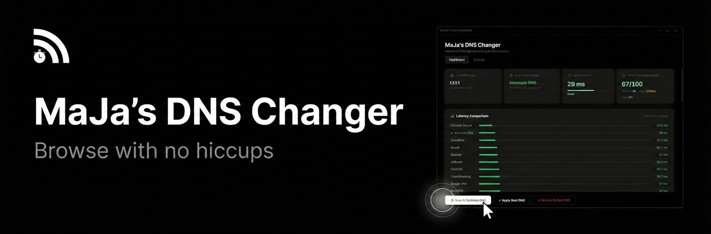

<p align="center">
  
</p>

<p align="center">
  <strong>Smart DNS Optimization Tool for Windows</strong>
</p>

<p align="center">
  <a href="#features">Features</a> •
  <a href="#installation">Installation</a> •
  <a href="#development">Development</a> •
  <a href="#build">Build</a> •
  <a href="#tech-stack">Tech Stack</a> •
  <a href="#license">License</a>
</p>

<p align="center">
  
  
  
  
  
</p>

---

## About

**MaJa's DNS Changer** is a desktop application that benchmarks 17 public DNS providers using multiple measurement methods, ranks them by a composite performance score, and lets you apply the fastest one to your system with a single click.

No more guessing which DNS is best for your connection — let the app test them all and pick the winner.

---

## Features

- **Multi-Method Benchmarking** — Tests each provider using ICMP ping, DNS resolution, and HTTPS latency for accurate results
- **17 Built-in DNS Providers** — Cloudflare, Google, Quad9, OpenDNS, AdGuard, NextDNS, ControlD, Mullvad, CleanBrowsing, and more
- **Composite Performance Score** — Rated 0–100 based on latency, stability, jitter, and packet loss
- **One-Click Apply & Restore** — Apply the best DNS or restore to default DHCP settings instantly
- **Auto-Optimize on Launch** — Optionally scan and apply the best DNS every time the app starts
- **Preferred Provider Lock** — Override auto-selection and always use your favorite provider
- **Configurable Scan Intensity** — Fast (3 tests), Normal (5), or Deep (10) per method
- **Real-Time Progress** — Live scan visualization with per-provider progress updates
- **Persistent Results** — Scan history saved locally for future reference
- **Native Notifications** — Desktop notification with sound when benchmarking completes
- **Modern UI** — Smooth animations, interactive charts, and a polished dark interface

---

## Installation

### Download

Head to the [Releases](../../releases) page and download the latest version:

| File | Description |
|------|-------------|
| `MaJa's DNS Changer Setup.exe` | Full installer with custom install location |
| `MaJa's DNS Changer Portable.exe` | Portable version — no installation needed |

### System Requirements

- Windows 10 / 11
- Administrator privileges (required to change DNS settings)

---

## Development

### Prerequisites

- [Node.js](https://nodejs.org/) (v18+)
- [pnpm](https://pnpm.io/)

### Setup

```bash
# Clone the repository
git clone https://github.com/ComplexMaJa/MaJa-s-DNS-Changer.git
cd MaJa-s-DNS-Changer

# Install dependencies
pnpm install

# Start in development mode
pnpm electron:dev
```

### Available Scripts

| Script | Description |
|--------|-------------|
| `pnpm dev` | Start Vite dev server (renderer only) |
| `pnpm electron:dev` | Start full Electron app in dev mode |
| `pnpm electron:compile` | Compile Electron TypeScript files |
| `pnpm build` | Build renderer + compile Electron |
| `pnpm electron:build` | Full production build with installer |
| `pnpm lint` | Run ESLint |

---

## Build

To create a production build with installer:

```bash
pnpm electron:build
```

Output is generated in the `release/` directory:

```
release/
├── MaJa's DNS Changer Setup {version}.exe
└── MaJa's DNS Changer {version}.exe (Portable)
```

The installer includes a custom sidebar image, branded icons, and a multi-step installation wizard.

---

## Tech Stack

| Layer | Technology |
|-------|------------|
| Framework | Electron 34 |
| Frontend | React 19 |
| Bundler | Vite 6 |
| Language | TypeScript 5.7 |
| Animations | Framer Motion |
| Charts | Recharts |
| Package Manager | pnpm |
| Installer | electron-builder (NSIS) |

---

## DNS Providers

| Provider | Primary | Secondary |
|----------|---------|-----------|
| Cloudflare | 1.1.1.1 | 1.0.0.1 |
| Google | 8.8.8.8 | 8.8.4.4 |
| Quad9 | 9.9.9.9 | 149.112.112.112 |
| OpenDNS | 208.67.222.222 | 208.67.220.220 |
| AdGuard | 94.140.14.14 | 94.140.15.15 |
| NextDNS | 45.90.28.0 | 45.90.30.0 |
| ControlD | 76.76.2.0 | 76.76.10.0 |
| Mullvad | 194.242.2.2 | 193.19.108.2 |
| CleanBrowsing | 185.228.168.9 | 185.228.169.9 |
| Alternate DNS | 76.76.19.19 | 76.223.122.150 |
| Comodo Secure | 8.26.56.26 | 8.20.247.20 |
| DNS.SB | 185.222.222.222 | 45.11.45.11 |
| FreeDNS | 45.33.32.156 | 45.33.97.5 |
| UncensoredDNS | 91.239.100.100 | 89.233.43.71 |
| Yandex DNS | 77.88.8.8 | 77.88.8.1 |
| SafeDNS | 195.46.39.39 | 195.46.39.40 |
| OpenNIC | 172.98.193.42 | 66.187.76.168 |

---

## License

This project is licensed under the [MIT License](LICENSE).

---

<p align="center">
  Made with ❤️ by <a href="https://github.com/ComplexMaJa">Yours Truly</a>
</p>
